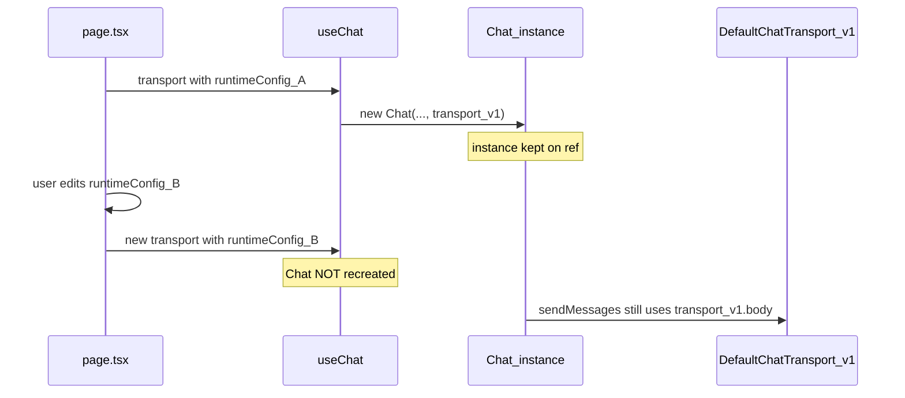

# Admin Mode: demo steps and why it feels broken

## Intended demo (matches [README.md](README.md) walkthrough)

1. **Wait for boot** — A full-screen boot overlay runs for ~1.4s (`[app/page.tsx](app/page.tsx)` `setTimeout` → `setIsBooting(false)`). You cannot click through it until it clears (`z-index: 120` on `[.bootOverlay](app/globals.css)`).
2. **Open the panel** — Scroll to the **Admin Config** block (above **Live Transcript**). Click **Show Admin Mode** to expand tone, boundary, locked handoff phrase, and presets.
3. **Change persona** — Edit **Persona tone** and/or **Boundary policy summary**, or use chips (e.g. **Tone: Expert**, **Boundary: Strict Scope**).
4. **Prove it on the LLM path** — Ask a **new in-scope question** that routes to the model (not a pure guardrail reply). Example from README: use a starter chip like **Firmware Setup** or ask a store-policy question. Tone shows up in `buildSystemPrompt` (`[src/lib/chat-prompt.ts](src/lib/chat-prompt.ts)`); boundary affects scope framing. **Guardrail-only** paths (out-of-scope, some handoffs) will not show a style change because they never call `streamText` with that prompt.
5. **Env** — `OPENROUTER_API_KEY` must be set in `.env.local` or you get the deterministic “can’t reach the AI service” stream (`[app/api/chat/route.ts](app/api/chat/route.ts)`), which is not useful for showing persona changes.

## Root cause: stale `runtimeConfig` on the wire

Flow today:

- `[app/page.tsx](app/page.tsx)` builds `new DefaultChatTransport({ api: "/api/chat", body: { runtimeConfig } })` inside `useMemo([runtimeConfig])`, so the **transport object** updates when config changes.
- `@ai-sdk/react` `useChat` creates a single internal `[Chat](file:///Users/boyu/projects/pixel-bot/node_modules/ai/dist/index.mjs)` and only recreates it when `options.chat` or `options.id` changes — **not** when `transport` changes. The first transport (with the **initial** `runtimeConfig`) stays attached (`[AbstractChat` assigns `this.transport` in the constructor](file:///Users/boyu/projects/pixel-bot/node_modules/ai/dist/index.mjs)).
- The API correctly reads `body.runtimeConfig` (`[app/api/chat/route.ts](app/api/chat/route.ts)` lines 69–72), but the client keeps sending the old values.

So **Admin Mode “works” in the UI** (state updates, panel toggles) but **does not affect answers** after the first load.

## Minimal fix (after you exit plan mode)

Per the AI SDK, `sendMessage` accepts a second argument `ChatRequestOptions` with `body` — merged over the transport’s default body in `[HttpChatTransport.sendMessages](file:///Users/boyu/projects/pixel-bot/node_modules/ai/dist/index.mjs)` (`{ ...resolvedBody, ...options.body }`).

- In `[submitText](app/page.tsx)`, change to pass the **current** config, e.g. `sendMessage({ text: trimmed }, { body: { runtimeConfig } })` (all user sends go through `submitText`; starter chips use it too).

Optional hardening: keep `useMemo` transport for initial body or simplify once `body` is always passed on send.

## Quick verification

After the fix: set tone to something unmistakable (e.g. “Reply in pirate speak for every sentence”), send an in-scope question, and confirm the assistant follows it. Without the fix, behavior stays at the default tone.