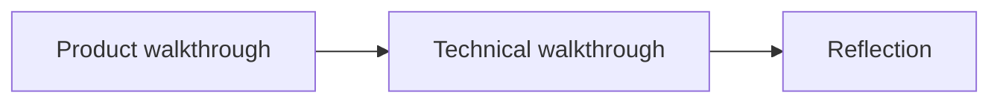

# Demo video readiness and recording plan

## Are you ready?

**Yes — for content and scope.** [README.md](README.md) already maps CSA requirements (business context, chat UI, KB grounding, persona, boundaries/handoff), includes the **3–5 minute** structure (product → technical → reflection), a **demo pre-flight checklist**, a **product walkthrough script**, and **Phoenix validation** steps. The [.cursor/plans/csa_demo_stage_plan_d42e74d9.plan.md](.cursor/plans/csa_demo_stage_plan_d42e74d9.plan.md) notes the remaining gap is **verification + recording**, not large feature work.

**Gate before you hit record:** complete the pre-flight below once. If anything fails (API errors, handoff phrase mismatch, Phoenix empty), fix or adjust the script before recording — that is the only real “not ready” condition.

---

## Pre-flight (do this the same day or the day before)

Estimated **30–45 minutes** total.

| Step | What to do                                                                               | Pass criteria                                                                                              |
| ---- | ---------------------------------------------------------------------------------------- | ---------------------------------------------------------------------------------------------------------- |
| 1    | `.env.local` has valid `OPENROUTER_API_KEY`; restart `npm run dev` after any edit        | Chat streams; no setup error in UI                                                                         |
| 2    | Optional: `phoenix serve` in a second terminal if the technical segment will show traces | [http://127.0.0.1:6006](http://127.0.0.1:6006) loads                                                       |
| 3    | `npm run lint` and `npm test`                                                            | Clean if you have not changed code; fix or note if red                                                     |
| 4    | Walk [Manual test matrix](README.md) (lines ~183–201)                                    | Recommendation clarifier, repair + exact phrase + `DEMO-…` ticket, out-of-scope, return policy, admin tone |

**Dry run:** Run through the **exact** user journey you will show on camera once without recording. Keep browser zoom and window layout how you will use them in the final take.

---

## Video structure (CSA three parts)

Aligns with [README “Demo video”](README.md) (lines ~231–237).

- **Product:** who it is for, realistic chat (chips → clarifier → repair + mock ticket; optionally policy or out-of-scope).
- **Technical:** where guardrails, KB, streaming, and admin live; optional Phoenix spans.
- **Reflection:** trade-offs, next 3 features, AI tools (what worked / finicky) — content is already in README sections linked there.

---

## Time schedule (target **4 minutes**; stretch to **5** if you add Phoenix + extra policy demo)

Use this as a **script card**; adjust ±15s per segment to hit 3–5 minutes total.

| Time          | Segment                     | What to show / say                                                                                                                                                                                                            |
| ------------- | --------------------------- | ----------------------------------------------------------------------------------------------------------------------------------------------------------------------------------------------------------------------------- |
| **0:00–0:25** | Hook + context              | One sentence: retro handheld shop support; firmware, recommendations, policy, human handoff when needed.                                                                                                                      |
| **0:25–1:15** | User journey — guided start | Empty state → **starter chip** → one follow-up so the flow feels natural.                                                                                                                                                     |
| **1:15–2:15** | Recommendation clarifier    | Prompt that **does not** include budget + form factor (per matrix) → expect **budget + form factor** ask; optional second message with both to show multi-turn.                                                               |
| **2:15–3:00** | Repair + handoff            | Broken device + **ZIP** + issue details → **exact** phrase: *I'll connect you with a human technician to finalize your repair quote.* → **mock ticket** `DEMO-…` on screen.                                                   |
| **3:00–3:45** | Owner / admin               | Admin mode: change tone or boundary preset → **new** question → visible style shift; one line that **handoff phrase stays locked** for consistency.                                                                           |
| **3:45–4:30** | Technical tour              | Split screen or tab switch: `app/api/chat/route.ts` (path + stream), `src/lib/knowledge-base.ts` + `retrieval.ts`, `handoff.ts` / `chat-path.ts`, admin wiring in `app/page.tsx`. Pick **2–3 files**, do not read every line. |
| **4:30–4:50** | Optional observability      | If Phoenix running: show `pixelbot.chat.request` and, after handoff, `pixelbot.handoff.mock_ticket` (per README Phoenix section). Skip if time or if Phoenix flaky.                                                           |
| **4:50–5:00** | Reflection                  | One trade-off (e.g. keyword retrieval vs embeddings), one sentence on **next 3 features**, one on **AI tools** (manual UI pass for guardrails).                                                                               |

**If you must fit 3 minutes:** drop optional Phoenix and one of: second recommendation turn, or separate out-of-scope clip — keep clarifier + repair + admin + 60s technical + 30s reflection.

---

## Comprehensive recording guide

**Environment**

- Single monitor: app full screen for product; IDE split or second segment only for technical.
- Close unrelated tabs; set Do Not Disturb; use a **stable** network if the LLM streams live.

**Prompts (have them in a scratch note)**

- Clarifier: e.g. *Can you recommend something for GBA and SNES?* (no budget/form factor in same message — per README matrix).
- Repair: cracked screen + ZIP + details in one or two messages as you prefer, as long as handoff conditions are met.
- Policy: *What is your return window?*
- Out-of-scope (optional): short weather or medical ask.

**Technical segment**

- Files worth opening (do not exceed ~90s): [app/api/chat/route.ts](app/api/chat/route.ts), [src/lib/knowledge-base.ts](src/lib/knowledge-base.ts), [src/lib/retrieval.ts](src/lib/retrieval.ts), [src/lib/handoff.ts](src/lib/handoff.ts) or [src/lib/chat-path.ts](src/lib/chat-path.ts), [src/lib/chat-prompt.ts](src/lib/chat-prompt.ts), [app/page.tsx](app/page.tsx) for admin.
- One sentence each: “Guardrails run before the model”; “KB is curated Q&A”; “Admin is session config.”

**Reflection (memorize three bullets)**

- Trade-offs: [Trade-offs (prototype scope)](README.md).
- Next: [Next 3 features (real product path)](README.md).
- AI tools: [CSA short write-up — How I used AI tools](README.md).

**Tools**

- Loom, QuickTime, or similar; resolution where chat and code are readable (often 1080p window, 125–150% zoom in IDE if needed).

**If something goes wrong on camera**

- LLM rambling: stop, say “I’ll ask that more narrowly,” use a matrix prompt.
- Handoff wrong: do not fake it — cut and re-record that segment after checking ZIP + issue wording.

---

## After recording

- Trim dead air at start/end; verify audio levels.
- Upload per CSA (link in submission); confirm **GitHub** access (public or private + reviewer).
- Quick README skim: run commands and env names still match [Quickstart](README.md).

---

## Success criteria

- All three CSA video parts appear clearly.
- At least one **deterministic** moment (clarifier or refusal) and one **handoff + mock ticket** moment.
- Technical segment names real files and one observability angle (code or Phoenix).
- Reflection hits trade-offs + roadmap + AI tooling without reading README verbatim for 2 minutes.

