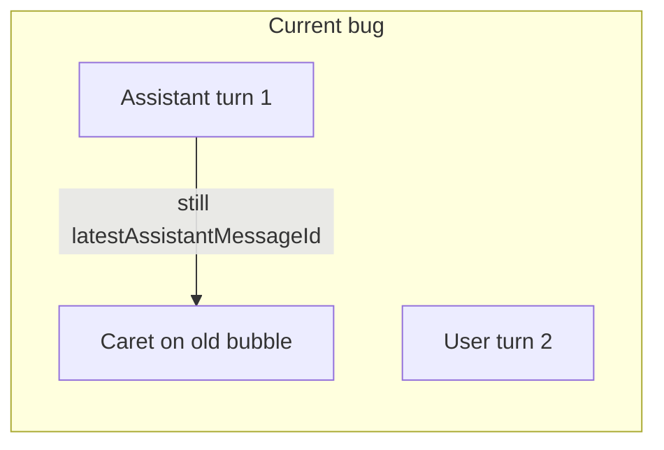

# Fix follow-up turn: caret vs 3-dot loading

## Root cause

In `[app/page.tsx](app/page.tsx)`, two derived flags drive the UI:

1. `**showStandaloneLoading**` (lines 146, 513–528) is `isLoading && !latestAssistantMessageId`. The standalone 3-dot row only shows when there is **no** assistant message in the thread yet (first turn only).
2. `**isStreamingAssistant`** (lines 438–441) is `isLoading && assistant && m.id === latestAssistantMessageId`. Here `**latestAssistantMessageId`** walks from the end and returns the **most recent assistant** anywhere in the list (lines 126–130), not “the assistant for this request.”

After a follow-up, the message order is `[..., assistant_turn1, user_turn2]`. While the new reply is pending:

- `latestAssistantMessageId` is still **turn1’s** assistant id.
- That message matches `isStreamingAssistant`, has non-empty text, so it gets class `**streamingText`** → the CSS caret on `[.msg.streamingText .content::after](app/globals.css)` (lines 643–656) blinks on the **old** bubble.
- `showStandaloneLoading` is false (an assistant exists), so no new 3-dot row appears below the latest user message.

## Fix (minimal, localized)

Adjust the conditions so “active assistant streaming” means **the last transcript message is that assistant message**, and “waiting for assistant” means **loading and the last message is not an assistant** (including empty transcript edge).

| Flag                                                               | New logic                                                             |
| ------------------------------------------------------------------ | --------------------------------------------------------------------- |
| **Streaming assistant** (caret or inline 3-dot inside that bubble) | `isLoading && m.role === "assistant" && messages.at(-1)?.id === m.id` |
| **Standalone 3-dot row**                                           | `isLoading && (messages.length === 0                                  |

This preserves:

- **First user message only**: `messages = [user]` → last is not assistant → standalone 3-dot (same as today when there was no assistant yet).
- **Streaming first reply**: last message is assistant → standalone off; that row shows inline 3-dot or caret as today.
- **Follow-up pending**: last message is user → standalone 3-dot under the new user line; previous assistant has no `streamingText` and no false inline typing.

## Code changes

- `**[app/page.tsx](app/page.tsx)`**  
  - Replace `showStandaloneLoading` with the “last message not assistant” condition.  
  - Replace `isStreamingAssistant` to require `messages.at(-1)?.id === m.id` (and drop the `latestAssistantMessageId` equality).  
  - Remove the `**latestAssistantMessageId`** `useMemo` if nothing else references it (currently only these two call sites).

No CSS changes required unless you want different spacing for the standalone loader after a user message (current `.loadingMsg` styles should suffice).

## Quick verification

1. First message: confirm standalone 3-dot, then streamed reply with caret, then ready.
2. Second message: after send, confirm 3-dot row appears **below** the new user line and the **previous** assistant message has **no** blinking caret until the new reply streams.

