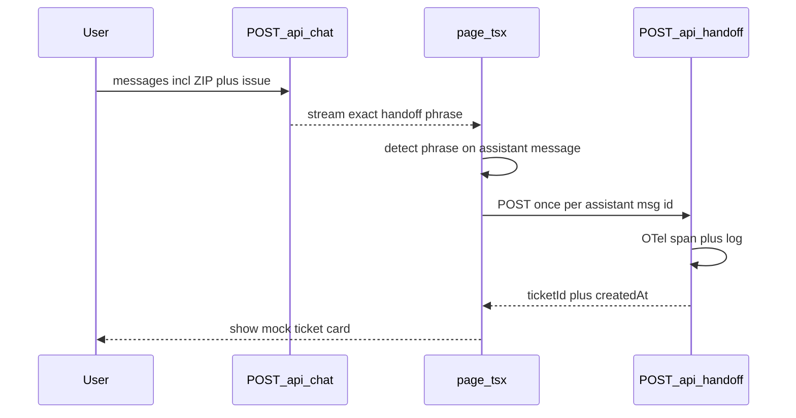

# Handoff mock API + demo (plan)

## Context (unchanged)

Guardrail handoff still streams the exact phrase from `[HANDOFF_TRIGGER_PHRASE](src/lib/chat-prompt.ts)` via `[app/api/chat/route.ts](app/api/chat/route.ts)` when `[resolveChatPath](src/lib/chat-path.ts)` returns `reason: "handoff_ready"`. The new work **adds a second step**: after the user sees that phrase in the UI, the client calls a **mock ticketing** endpoint so the demo can show a believable “case created” artifact without Zendesk/etc.

## 1) Server — `[app/api/handoff/route.ts](app/api/handoff/route.ts)`

- **Method**: `POST` only; `405` for others.
- **Body** (JSON, all optional): e.g. `{ messageCount?: number }` or `{ reason?: "repair_handoff" }` — keep **minimal** so the demo does not imply we store full transcripts (PII). Accept empty `{}`.
- **Response** `200`: `{ ticketId: string, createdAt: string }` where:
  - `ticketId` format like `DEMO-` + short unique suffix (e.g. base36 timestamp or `crypto.randomUUID` slice) so repeat handoffs in one session get distinct ids; avoid a **literal** fixed `DEMO-123` every time unless you add a query flag for screenshots only.
- **Logging**: `console.info` with ticket id (and optional message count) — visible in the terminal running `npm run dev`.
- **OpenTelemetry**: Mirror `[app/api/chat/route.ts](app/api/chat/route.ts)`: `trace.getTracer("pixel-bot.chat")`, `ROOT_CONTEXT`, span name e.g. `pixelbot.handoff.mock_ticket`, `SpanKind.SERVER` or `INTERNAL`, attributes such as:
  - `pixelbot.component` = `api.handoff`
  - `pixelbot.handoff.ticket_id` = generated id
  - `openinference.span.kind` / `span_kind` consistent with existing patterns (CHAIN or INTERNAL — prefer **INTERNAL** for a sub-operation, or SERVER if you want it as a top-level route span; document in README Phoenix filter).
- **Errors**: malformed JSON → `400`; unexpected failure → `500` with `{ error: string }`.

Optional tiny helper in `[src/lib/](src/lib/)` for `createDemoTicketId()` if you want a one-line unit test on format — only if it stays trivial.

## 2) Client — `[app/page.tsx](app/page.tsx)`

- **Trigger**: When an **assistant** message’s text (from existing `messageText()`) **equals** `HANDOFF_TRIGGER_PHRASE` (same constant already on the page), after streaming completes (`status === "ready"`).
- **Dedupe**: `useRef<Set<string>>` of assistant `message.id` values already “ticketed” so React strict mode / re-renders do not double-post.
- **Fetch**: `fetch("/api/handoff", { method: "POST", headers: { "Content-Type": "application/json" }, body: JSON.stringify({ reason: "repair_handoff", messageCount: messages.length }) })`.
- **UI**: Inline **card** directly under that assistant bubble (or immediately below the transcript block for that turn):
  - Title: e.g. “Mock repair ticket (demo)”
  - Monospace `ticketId`, optional “Copy” button
  - Subline: “No external system—shown for prototype escalation.”
- **States**: brief loading spinner on the card; on failure show a small error line (retry optional — keep simple: “Could not create demo ticket”).

Do **not** change the chat transport or guardrail logic; this is purely client-side follow-up.

## 3) Styling

Reuse existing classes (`panelLabel`, borders, `ghostButton`) where possible; add one small class in `[app/globals.css](app/globals.css)` if needed for the ticket strip so it matches the retro HUD look.

## 4) Tests (lightweight)

- **Unit**: Optional test for `createDemoTicketId` if extracted; or skip if logic stays inline.
- **Route**: Optional `fetch` in Vitest against the handler — only if the project already tests API routes; otherwise manual demo is enough for prototype scope.

## 5) Demo script (for README + live walkthrough)

1. **Setup**: `npm run dev`, optional `phoenix serve` if showing traces.
2. **Chat**: Use “Repair Handoff” starter or type crack + ZIP in two messages (see existing manual matrix).
3. **Observe**: Exact handoff phrase appears; within a second, **mock ticket card** shows new `DEMO-…` id.
4. **DevTools**: Network tab → `POST /api/handoff` → `200` + JSON body.
5. **Terminal**: Server log line with the same ticket id.
6. **Phoenix** (optional): Filter `name contains 'handoff'` or `pixelbot.component` = `api.handoff` — confirm span and `pixelbot.handoff.ticket_id`.

## Out of scope

- Auth, rate limits, persistence, webhooks to external systems.
- Calling `/api/handoff` from the server inside `/api/chat` (would duplicate concerns; client-driven keeps the guardrail path unchanged and matches “user saw the promise, then system files ticket” narrative).

When you are ready to implement, ask to **execute this plan** (or “implement”) and we can apply the code changes.