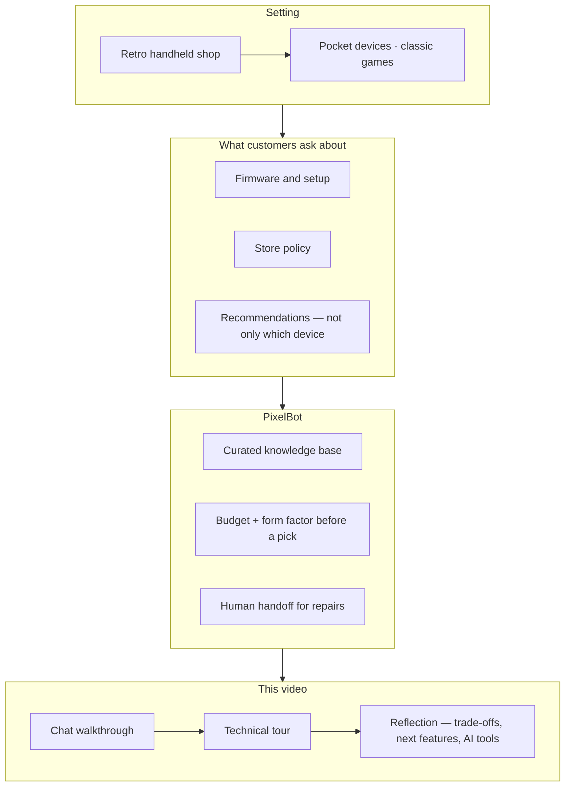
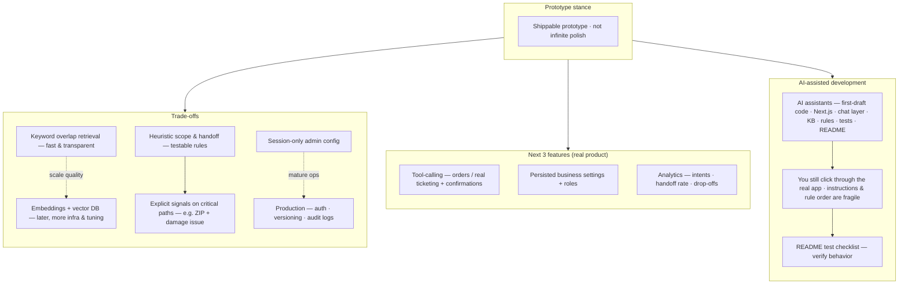

I need to produce a 4-5 min demo video.

## Todos
+ [x] Intro
+ [x] Boot Screen
+ [x] Recommendations
+ [x] Recommendations with Admin Mode (Tone: Expert)
+ [x] Hand-off
+ [x] Out of Scope
+ [x] Phoenix Telemetry
+ [x] Technical tour
+ [x] Reflections
    + [x] trade-offs
    + [x] next features
    + [x] AI tools
+ [ ] Wrap Up


1. What is Retro handheld (for new viewers), and what does PixelBot do?

**Retro handheld (new viewers):** Small portable devices for playing classic games—think Game Boy–era titles, home-console ports, and ROMs—often with modern screens, better battery life, and community firmware. Shoppers care about compatibility, setup, and store policy as much as “which device is coolest.”

**PixelBot:** The prototype **AI support agent** for that shop. It answers from a **curated knowledge base** (firmware, setup, policies), **qualifies recommendations** (e.g. asks for budget + form factor before suggesting hardware), and **escalates to a human** for repair-style cases with a fixed handoff phrase and a **mock ticket** in the UI—so the demo shows grounded support, not a generic chatbot.

**Hook + context (~0:00–0:25, CSA *product* part)**

**Spoken script (read on camera):**

> Hi—this is **PixelBot**, an AI support agent for a **retro handheld** shop: pocket devices for playing classic games, where customers ask about **firmware**, **setup**, and **store policy**, not only which device to buy. It answers from a **curated knowledge base**, asks **budget and form factor** when someone wants a recommendation, and **hands off to a human** when the case is a real **repair**. I’ll walk through the **chat**, then a **quick technical tour**, then **reflection**—trade-offs, next features, and how I used AI tools.

**Hook diagram (for slides / B-roll):** paste into [mermaid.live](https://mermaid.live) and export PNG/SVG.



```
"This video is not sponsored by or affiliated with Litnxt. All product names, logos, and brands are property of their respective owners."
```

**If you’re long on time:** drop the sentence after the colon and start at “It answers from a curated knowledge base…”

**Ultra-short cheat (~10s):** *Retro handheld shop support—KB-grounded answers, guided recommendations, policy, and human handoff for repairs; then tech, then reflection.*

**Chat 1 — boot → qualify → recommend (~0:25–1:10, adjust to your pacing)**

**Spoken script (read on camera):**

> First, here’s the boot screen—this is PixelBot in the shop.
>
> I’ll ask: *Can you recommend something for GBA and SNES?*
>
> Notice it doesn’t jump straight to a device. It **qualifies the lead**—it asks for **budget** and **form factor** so the pick isn’t a random guess.
>
> I’ll answer: *about a hundred twenty dollars*, and *pocket-sized*.
>
> Now it can give a **grounded recommendation**—still tied to what we know from the knowledge base, not generic “best handheld” chatter.

**User messages to send (exact):**

1. `Can you recommend something for GBA and SNES?`
2. `$120 and pocket-sized.`

**Recording tip:** Narrate PixelBot’s *behavior* (qualification, grounding) rather than reading its reply word-for-word, so the take still works if wording varies between runs.

**Ultra-tight (~25–35s):** *Boot screen—PixelBot for the retro handheld shop. I ask for a GBA and SNES recommendation; it asks budget and form factor first. I say one-twenty and pocket-sized—then we get a real recommendation.*

**Admin Mode — Expert tone, same recommendation (~25s)**

**Spoken script (read on camera):**

> Next—**Admin Mode**: this is where an operator can tune how PixelBot sounds **without redeploying**. I’ll set **Tone** to **Expert**, then run the **same** flow: GBA and SNES recommendation, **about a hundred twenty dollars**, **pocket-sized**.
>
> The **qualification** is still the same—budget and form factor—and answers stay **grounded in the knowledge base**. What changes is the **depth**: in Expert, you should see **richer trade-offs**, **setup or compatibility caveats**, and a more **technical** walkthrough—still not a generic essay.

**Admin steps (do on screen):**

1. Click **Show Admin Mode** (under **Admin Config**).
2. Under **Quick presets**, choose **Tone: Expert** (this fills **Persona tone**).
3. Use **New Chat** if you want a clean A/B next to Chat 1, then send the **same user messages** as Chat 1 (or stay in-thread if you only care about the second Expert reply—pick one and stay consistent).

**User messages (same as Chat 1):**

1. `Can you recommend something for GBA and SNES?`
2. `$120 and pocket-sized.`

**Recording tip:** Contrast **length and density** with Chat 1 (“more steps, more nuance”) instead of reading Expert’s full reply aloud.

**Ultra-tight (~12–15s):** *Admin Mode—Tone Expert. Same GBA/SNES ask and same budget and pocket form factor; qualification still applies, but the answer comes back more detailed and technical.*

**Handoff — Repair starter → ZIP → mock ticket (~30–45s, or ~20s tight)**

**Spoken script (read on camera):**

> For **repairs**, PixelBot is **not** pretending to price a fix in chat. It needs a **clear issue** and a **ZIP code** for routing—then it uses a **fixed handoff line** and the UI creates a **demo repair ticket**—no external helpdesk wired up.
>
> I’ll use the **Repair Handoff** starter: cracked screen, repair quote. Then I’ll send my ZIP: **three–zero–zero–three–three**.
>
> When PixelBot returns the exact escalation line—*I’ll connect you with a human technician to finalize your repair quote*—watch the transcript: a **mock ticket** appears with an ID and timestamp. That’s the **escalation artifact** for the demo.

**On-screen steps:**

1. **New Chat** (clean thread after recommendations / admin, if you’re continuing from the same session).
2. Under **Starter prompts**, click **Repair Handoff** (sends: *My handheld screen is cracked and I need a repair quote.*).
3. Send a second message with your ZIP: `30033` (five digits is enough for the app to detect a U.S. ZIP).

**What you should see:** After the assistant message equals the locked handoff phrase, a card titled **Mock repair ticket (demo)** with a ticket id, timestamp, and the footnote that there is no external system—prototype escalation only.

**Recording tip:** Let the **ticket card** land on screen for a beat; you don’t need to read the ticket id aloud unless you want to emphasize “case created.”

**Ultra-tight (~20s):** *Repair flow: Repair Handoff starter, then ZIP three-zero-zero-three-three. Fixed handoff phrase, then a mock repair ticket id in the UI—demo escalation, not a real ticketing integration.*

**Out of scope — weather (guardrail, ~15–25s)**

**Spoken script (read on camera):**

> Quick **boundary** check: if someone asks something totally unrelated—like **weather**—PixelBot shouldn’t improvise. It should **refuse cleanly** and **redirect** to handheld support and **store policies**.
>
> I’ll ask: *What’s the weather like today?* You should get a **short, deterministic** reply—same idea every time—not a mini forecast.

**User message to send (exact):**

`What's the weather like today?`

**Expected assistant reply (deterministic guardrail in app):**

> I can help with retro handheld questions (firmware/setup/compatibility) and store policies only. If you share a retro handheld issue or policy question, I can help right away.

**On-screen steps:** **New Chat**, type the weather question, send.

**Recording tip:** You can **paraphrase** the on-screen reply (“polite no + what it *can* do”) instead of reading it verbatim; the important beat is **no off-topic answer**.

**Ultra-tight (~12s):** *Off-topic question—weather. PixelBot stays in scope: handhelds and store policy only, no invented answer.*

**Phoenix telemetry — traces, costs, latency (~30s)**

**Spoken script (read on camera):**

> On the **observability** side, traces go to **Arize Phoenix** over **OpenTelemetry**. Each user turn shows up as a **trace** made of **spans**—for example the **chat request** span and the **LLM** span underneath it—so you can see **where time goes**, not just “the model was slow.”
>
> The model span also records **token counts**, which Phoenix can turn into **cost** visibility instead of guessing from the UI. Handoff and other routes can show up as their own spans too, so **support flows** leave a **debuggable trail**.

**Optional demo setup (before recording this beat):** In a separate terminal, run `phoenix serve` (see README), keep `PHOENIX_COLLECTOR_ENDPOINT` pointing at `http://127.0.0.1:6006/v1/traces`, send a normal chat message, then open the Phoenix UI and select a trace (e.g. **`pixelbot.chat.request`**).

**Recording tip:** **Pan** from span list → **waterfall** / duration → **token** attributes on the LLM span; name **OpenTelemetry**, **traces**, **spans**, **latency**, **tokens/cost** once each—no need to read attribute keys aloud.

**Ultra-tight (~15s):** *OTel traces in Phoenix: nested spans for the chat path and LLM, latency in the waterfall, token counts for cost awareness—optional local Phoenix, same project as README.*

**Technical tour — how to prepare (~60–90s on camera)**

**Before you record this beat**

1. **IDE layout:** Open the repo in your editor and pin **one vertical split** or **tabs in this order** (top → bottom matches request flow):
   - `app/page.tsx` — `useChat` → `POST /api/chat` with `runtimeConfig`; starter chips; Admin panel; after handoff phrase, client `POST /api/handoff` + mock ticket UI.
   - `app/api/chat/route.ts` — entry: OpenTelemetry `pixelbot.chat.request`, then `resolveChatPath`; guardrails return a **synthetic stream**; LLM path uses `streamText` + telemetry.
   - `src/lib/chat-path.ts` — **single router** for deterministic behavior (read the `if` chain top-to-bottom once on camera).
   - `src/lib/knowledge-base.ts` + `src/lib/retrieval.ts` — small KB; keyword overlap picks snippets for the **last user message**.
   - `src/lib/chat-prompt.ts` — system prompt: KB block + lead qualification + handoff instructions.
   - `src/lib/handoff.ts` — scope signals, recommendation thread state, repair ZIP + issue signals.
   - `app/api/handoff/route.ts` — mock `ticketId` + span `pixelbot.handoff.mock_ticket` (no external CRM).
   - Optional fourth tab: `instrumentation.ts` — OTel export to Phoenix (one sentence if asked).

2. **Optional slide / B-roll:** README **Architecture** mermaid diagram (`## 🔧 How it works` → **Architecture**) — export PNG from [mermaid.live](https://mermaid.live) if you want a full-screen graphic instead of only code.

3. **Sanity:** `npm run dev` running; you’ve already walked product flows so the code story matches what viewers saw.

**Guardrail order to memorize** (same as `resolveChatPath` in `src/lib/chat-path.ts`): **out of scope** → **repair handoff ready** (issue + ZIP) → **repair missing ZIP** (issue but no ZIP) → **recommendation missing budget/form factor** → else **LLM** with retrieval + `buildSystemPrompt`.

**Spoken script (read on camera, ~60–90s):**

> On the **technical** side, the UI is **Next.js**—`useChat` in **`app/page.tsx`** posts to **`/api/chat`** and passes **admin runtime config** (tone, boundaries) on every request.
>
> The API route wraps each turn in an OpenTelemetry span, then calls **`resolveChatPath`** in **`chat-path.ts`**. That’s the **guardrail router**: it checks **scope** first, then **repair escalation**—exact phrase when **ZIP and issue** are present—then **recommendation** fields if someone’s shopping—otherwise it goes to the **LLM**.
>
> When we *do* call the model, **`retrieval.ts`** scores snippets from **`knowledge-base.ts`** and **`chat-prompt.ts`** folds them into the system prompt—so answers are **KB-grounded**, not a blank slate.
>
> **Handoff** is special: the chat route only returns the **locked phrase**; the browser then calls **`/api/handoff`** to mint a **demo ticket id**—that’s the mock escalation path.
>
> Optional **Phoenix** ties to **`instrumentation.ts`**: traces for the chat and model spans, which we already showed.

**Recording tip:** **Scroll** the `resolveChatPath` `if` chain once; **don’t** read every line—say “scope → handoff → repair ZIP → recommendation → LLM.” Point at **`quickResponse`** vs **`streamText`** in the API route in two seconds if you have time.

**Ultra-tight (~25s):** *Next chat UI → API route → `resolveChatPath` guardrails → KB retrieval + prompt → LLM stream; handoff phrase plus separate `/api/handoff` mock ticket; OTel optional.*

**Reflections — trade-offs, next features, AI tools (~75–105s)**

**Spoken script (read on camera):**

> **Trade-offs:** I optimized for a **shippable prototype**, not infinite polish. Retrieval is **keyword overlap**—fast and easy to reason about for a demo; a real system might move to **embeddings** and a vector store at the cost of infra and tuning. **Scope and handoff** are **heuristic rules**—they’re testable and predictable, but they can miss messy phrasing, so the critical paths use **explicit signals** like **ZIP plus a damage issue**. **Admin config** is **session-only**—simple for the assignment; production would want **auth, versioning, and audit**.
>
> **Next three features** if this were real: **tool-calling** for order lookup or a **real** ticketing path with confirmations; **persisted** business settings with **roles**; and a small **analytics** view—top intents, handoff rate, where people drop off.
>
> **AI tools:** I used **Cursor** and LLMs to scaffold **Next.js**, the **AI SDK**, retrieval, guardrails, tests, and README passes. That sped up boilerplate a lot. The catch is you still need a **human pass in the UI**—prompt tweaks and **guardrail order** break easily; the **manual test matrix** in the README stayed the **source of truth**.

**Reflection diagram (slides / B-roll):** paste into [mermaid.live](https://mermaid.live) and export PNG/SVG.



**Cheat sheet (if you blank):** keywords only — *keyword KB · explicit guardrails · session admin · tools + persistence + analytics · AI drafts fast · click real app · README checklist*.

**Recording tip:** Three **clear breaths**—trade-offs → roadmap → AI tools—then a **one-line close** (e.g. *Thanks for watching—full detail is in the README.*).

**Ultra-tight (~35–40s):** *Trade-offs: keyword retrieval, rule-based scope and handoff, session admin, code guardrails + LLM answers. Next: tools, persisted settings, analytics. AI: assistants for speed; still test in the browser and follow the README checklist.*

