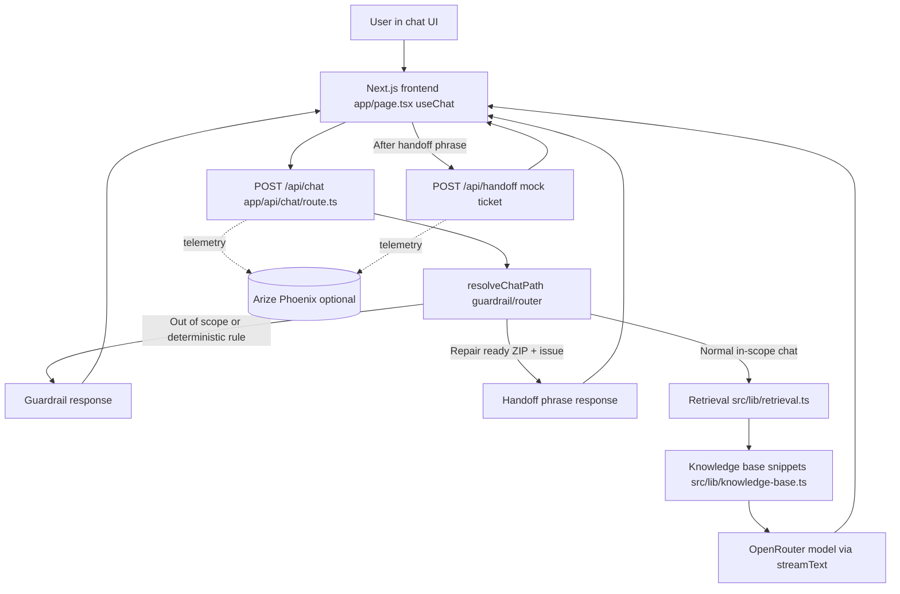

# PixelBot (Retro Handheld Support Agent)

## What this is
PixelBot is a prototype AI customer support agent for a retro handheld shop. It answers questions using a small local knowledge base (firmware/setup/help + store policies), and it includes:

*Why this shop and what job it does for the customer (CSA short write-up) lives in **[CSA short write-up](#csa-short-write-up)** below; this section is the feature summary.*

- Lead qualification: when the user asks for a recommendation, it asks for budget + preferred form factor before recommending anything.
- Human handoff (mock): when a user reports a broken device and provides both ZIP code + issue details, it outputs the exact trigger phrase:
  > I'll connect you with a human technician to finalize your repair quote.
  The UI then calls `POST /api/handoff` to show a demo repair ticket id (no external system).

## CSA short write-up

This section mirrors the CSA assignment brief: business context, user value, AI-assisted development, and product roadmap.

### Business and use case — why this setting?

*CSA prompt: What business / use case did you choose and why?*

A typical shopper might be **choosing between two devices before checkout**, **double-checking return policy before they buy**, or **debugging firmware right after unboxing**—different moments, same support surface.

Retro handheld retail is a strong prototype fit: customers mix **technical** questions (firmware, device setup, compatibility) with **policy** questions (returns, shipping) and occasional **repair** escalations. The domain is narrow enough to ground a small FAQ-style knowledge base while still feeling like a real shop—not a generic chatbot demo.

### What problem does this solve for the end user?

*CSA prompt: What problem does this agent solve for the end user?*

Buyers want **fast, trustworthy answers** grounded in store policy and product facts, **multi-turn help** when a recommendation depends on budget and preferences, and a **clear handoff** when the issue needs a human (for example hardware damage). The agent reduces time-to-answer and avoids the model inventing policies or repair commitments outside the KB and guardrails.

### How I used AI tools (what worked / what didn’t)

*CSA prompt: How did you use AI tools during development? What worked well? What didn’t?*

- **Tools:** Cursor and LLM assistants for scaffolding the Next.js + AI SDK stack, retrieval and guardrail modules, tests, and README iteration.
- **What worked well:** Rapid iteration on `app/api/chat/route.ts`, `src/lib/handoff.ts`, and keeping deterministic behavior checked with unit tests.
- **What didn’t / what to watch:** LLM-suggested prompt and ordering changes need a **manual pass in the real UI**—guardrail order and exact handoff phrasing are easy to break by accident; the manual test matrix is the source of truth.

### Next 3 features (if this were a real product)

*CSA prompt: If this were a real product, what would the next 3 features be?*

See **[Next 3 features (real product path)](#next-3-features-real-product-path)** below.

## Alignment with CSA requirements

### Required minimum scope

| CSA requirement | How PixelBot satisfies it |
|-----------------|----------------------------|
| Business context | Retro handheld shop; policies, devices, and support flows are consistent with that setting. |
| Chat interface | Web chat with multi-turn conversation (`useChat`), not a one-shot form. |
| Knowledge base | Curated Q&A in code (`src/lib/knowledge-base.ts`); retrieval injects snippets so answers are grounded, not purely from model priors. |
| Personality and instructions | System prompt + session admin tone/boundary controls (`src/lib/chat-prompt.ts`, Admin mode in UI). |
| Graceful boundaries | Out-of-scope handling, recommendation clarifiers, and human handoff with mock ticket (`src/lib/handoff.ts`, `src/lib/chat-path.ts`, `POST /api/handoff`). |

### Optional depth (implemented)

- **Streaming responses** — `streamText` + UI stream consumption.
- **Multi-turn reasoning** — Recommendation flow asks for budget + form factor across turns when needed.
- **Handoff logic** — Repair path with fixed escalation phrase and mock ticketing.
- **Admin / config view** — Session-level tone and boundary summary in the main UI.
- **Analytics or logging** — OpenTelemetry + optional Arize Phoenix for traces (LLM spans, handoff span).

Submit the project as a **GitHub** repository (public or private with reviewer access). This README covers local run, stack, what was built, trade-offs, and what you would do next.

## Quickstart

**Stack:** Next.js (App Router), React, Vercel AI SDK + OpenRouter, TypeScript. Core chat works without Phoenix; tracing is optional.

**Minimal setup (CSA-style):** `npm install`, configure `.env.local`, then run locally. For Next.js, day-to-day development uses `npm run dev`. A production-style run is `npm run build` followed by `npm start` (see **Run** below).

## Tech stack

- **Frontend/UI:** Next.js App Router, React, TypeScript, Vercel AI SDK (`useChat`).
- **Backend/API:** Next.js route handlers (`app/api/chat/route.ts`, `app/api/handoff/route.ts`), AI SDK `streamText`.
- **Model provider:** OpenRouter (`OPENROUTER_API_KEY`, configurable model via `OPENROUTER_MODEL`).
- **Agent logic:** Deterministic guardrails and routing in `src/lib/handoff.ts` and `src/lib/chat-path.ts`.
- **Knowledge grounding:** Curated local KB (`src/lib/knowledge-base.ts`) + lightweight retrieval (`src/lib/retrieval.ts`).
- **Observability:** OpenTelemetry spans with optional Arize Phoenix local viewer.
- **Testing:** Vitest unit tests and optional smoke eval scripts.

### 1) Install
```bash
npm install
```

### 2) Configure environment
Copy the example env file and fill in your key (recommended):

```bash
cp .env.example .env.local
```

Or create `.env.local` manually and set:
```bash
OPENROUTER_API_KEY=your_openrouter_api_key
OPENROUTER_MODEL=qwen/qwen3.5-plus-02-15

# Arize Phoenix local telemetry
PHOENIX_COLLECTOR_ENDPOINT=http://127.0.0.1:6006/v1/traces
PHOENIX_PROJECT_NAME=pixel-bot-local
# Optional (used for Phoenix Cloud). Keep empty for local.
PHOENIX_API_KEY=
```

### 3) Run (local development)
```bash
npm run dev
```

Open:
- http://localhost:3000

**Production-style run (after `npm install` and env setup):**
```bash
npm run build
npm start
```
Use this if you want to demo the app the same way as a built Next.js deployment.

Without `OPENROUTER_API_KEY`, the chat API returns a clear setup message (and the UI explains common API-key errors).

### Tests (optional)
```bash
npm test
```
Runs Vitest unit tests: guardrail logic (`src/lib/handoff.ts`), system prompt assembly (`src/lib/chat-prompt.ts`), and routing (`src/lib/chat-path.ts`). No API calls.

Optional live LLM checks (requires `OPENROUTER_API_KEY`; `vitest.smoke.setup.ts` loads `.env` / `.env.local` via Vite’s `loadEnv`, same as typical Vite projects):

```bash
npm run test:eval
```

Runs two smoke cases with `generateText` using the same prompt path as production.

Optional minimal LLM-as-judge rubric (cheap second model; set `OPENROUTER_JUDGE_MODEL` if you like):

```bash
npm run test:eval:judge
```

Runs smoke evals plus one structured JSON rubric pass (`in_scope`, `grounded_or_hedges`, `concise`) via `src/lib/reply-judge.ts`.

### 4) (Optional) Run local Arize Phoenix telemetry
Start Phoenix locally in a separate terminal:

```bash
pip install -U arize-phoenix
phoenix serve
```

Then open:
- http://127.0.0.1:6006

## How it works

### Architecture



### Chat
- Frontend: `app/page.tsx` uses the Vercel AI SDK `useChat` hook.
- Backend: `app/api/chat/route.ts` uses `streamText` and returns `toUIMessageStreamResponse()` for streaming UX.
- Admin mode: `app/page.tsx` exposes a session-level config panel for tone and boundary summary.
- LLM telemetry: `streamText` runs with `experimental_telemetry` enabled so local Phoenix can receive model-call traces.

### Knowledge base + retrieval
- The KB lives in `src/lib/knowledge-base.ts` (12 Q&As).
- `src/lib/retrieval.ts` does a lightweight keyword/token overlap scoring to pick the most relevant snippets for the current user message.

### Behavior logic
- `src/lib/handoff.ts` detects recommendation intent across the whole thread (so follow-ups without “recommend” still count), budget + form factor, and broken-device handoff readiness (ZIP + issue signals).
- `src/lib/handoff.ts` also classifies out-of-scope requests, including mixed-domain messages (unrelated + in-scope keywords).
- `src/lib/chat-path.ts` mirrors production guardrail order (scope, handoff, repair ZIP, lead qualification) before the LLM path; `src/lib/chat-prompt.ts` builds the system prompt used by both the API route and evals.
- The API route calls `resolveChatPath` then streams with `streamText` when the path is LLM.
- After the UI shows the repair handoff phrase, the client calls `POST /api/handoff` (mock ticket id + OpenTelemetry span `pixelbot.handoff.mock_ticket`; no external ticketing system).

## Product decisions
- **Configurable support persona**: session-level admin controls make the prototype feel like an agent platform.
- **Deterministic critical paths**: scope boundaries and escalation/handoff are code-enforced for reliability.
- **Retrieval-first responses**: weighted retrieval favors title/tags/question relevance over long-answer noise.
- **Guided first-turn UX**: starter prompt chips and capability framing reduce blank-screen friction and drive realistic support flows.

## Trade-offs (prototype scope)
- **Keyword retrieval vs embeddings**: token overlap is fast and transparent for a demo; embeddings + vector DB would scale KB quality at the cost of infra and tuning time.
- **Heuristic scope and handoff**: rules are easy to reason about and test; they can miss nuance or edge phrasing, so critical paths are narrowed to explicit signals (e.g. repair issue + ZIP).
- **Session-only admin config**: no persistence keeps the stack simple; production would want auth, versioning, and audit logs.
- **LLM for normal answers, code for guardrails**: balances reliability on escalation and policy boundaries with flexible language for in-scope Q&A.

## What admin/config mode demonstrates
- A business owner can tune assistant tone and boundaries without code edits.
- The handoff trigger phrase remains locked for compliance and consistent escalation.
- Config is session-level in this prototype, showing a path to persisted settings.

## Manual test matrix
1. **Recommendation clarification**
   - Input: “Can you recommend something for GBA and SNES?” (no budget or form-factor hint in the same message—avoid “under $…” or “pocket/handheld/…” so the clarifier runs.)
   - Expected: asks for **budget** and **preferred form factor** before recommending a device.
   - **Multi-turn check:** send “Recommend a retro handheld” first, then “$120 and pocket-sized” in a second message—expected: still treated as a recommendation flow and, once both fields are present, the model may recommend.
2. **Broken-device escalation**
   - Input: “My handheld screen is cracked” + ZIP + issue details.
   - Expected: outputs exactly: `I'll connect you with a human technician to finalize your repair quote.`
   - **Mock ticket (demo):** right after, the UI shows a **Mock repair ticket** card with a `DEMO-…` id. In DevTools Network, `POST /api/handoff` returns `{ ticketId, createdAt }`. The terminal running `npm run dev` logs `[pixelbot.handoff] mock ticket`.
3. **Out-of-scope boundary**
   - Input: weather/crypto/medical/legal unrelated questions.
   - Expected: polite refusal with redirection to retro-handheld/store-policy scope.
   - **Mixed-topic check:** e.g. “retro emulator on my iPhone” — expected: deterministic refusal explaining handheld-only scope (unrelated product + in-scope keywords).
4. **KB-grounded policy**
   - Input: “What is your return window?”
   - Expected: answer aligns with the KB return policy.
5. **Admin mode impact**
   - Change tone text in Admin mode and ask a new question.
   - Expected: response style reflects updated tone instructions.

## Phoenix telemetry validation (LLM calls only)
1. Start Phoenix (`phoenix serve`) and confirm UI is reachable at `http://127.0.0.1:6006`.
2. Start the app (`npm run dev`) and send one deterministic guardrail prompt (for example, an out-of-scope request) and one in-scope prompt that reaches the model.
3. In Phoenix UI, clear the filter box and keep `Root Spans: All`.
4. Confirm traces appear under project `pixel-bot-local` (or your `PHOENIX_PROJECT_NAME`) and verify:
   - Route span `pixelbot.chat.request` has non-empty status.
   - LLM path includes `pixelbot.chat.llm` with model metadata.
   - Guardrail path sets `pixelbot.response.path=guardrail` and reason attributes.
   - After a repair handoff (see manual test #2), a second request runs: span `pixelbot.handoff.mock_ticket` with `pixelbot.component=api.handoff` and `pixelbot.handoff.ticket_id` matching the UI card.
5. If rows still appear as generic HTTP spans only, restart `npm run dev` after env/config edits and retry both prompts.

### If `kind` or `status` still look empty/unknown in Phoenix
- Clear the filter box first. A filter like `span_kind == 'LLM'` can hide all rows if indexing is delayed.
- Keep `Root Spans` as `All`, then add columns for `name`, `span_kind`, `status`, and `openinference.span.kind`.
- Open one `pixelbot.chat.request` row and verify attributes include:
  - `span_kind=CHAIN`
  - `otel.status_code=OK` (or `ERROR`)
  - `status=OK` (or `ERROR`)
- Open one `pixelbot.chat.llm` row and verify attributes include:
  - `span_kind=LLM`
  - `openinference.span.kind=LLM`
  - `llm.model_name=<your model>`
- Known-good filter examples:
  - `name contains 'pixelbot.chat'`
  - `name contains 'handoff'` (mock ticket after repair escalation)
  - `span_kind == 'LLM'`
- Note: instrumentation exports a focused subset of spans (`pixelbot.chat*`, `ai.streamText*`, or spans with `openinference.span.kind`) to reduce noisy framework rows like `POST /api/chat`.

## Demo video (CSA deliverable — 3–5 minutes)

Record a screen capture (Loom, QuickTime, or similar). Structure it to match the assignment’s three parts; the detailed timing and talking points are in **Product walkthrough script** below.

1. **Product walkthrough** — Who is PixelBot for? Walk through a realistic chat: starter chip, recommendation clarifier, repair + handoff + mock ticket, and optionally policy or out-of-scope.
2. **Technical walkthrough** — Code layout: API route and guardrails, KB + retrieval, admin config, optional Phoenix traces.
3. **Reflection** — Trade-offs ([Trade-offs](#trade-offs-prototype-scope)), what you’d add with more time ([Next 3 features](#next-3-features-real-product-path)), and what worked or was finicky in development ([CSA short write-up](#csa-short-write-up)).

## Demo pre-flight checklist
1. Confirm `.env.local` exists with a valid `OPENROUTER_API_KEY`; restart `npm run dev` after changes.
2. Optional: start Phoenix (`phoenix serve`) if you want to show traces in the demo.
3. Run `npm run lint` and `npm test` once before recording if you changed behavior.
4. Follow the **Product walkthrough script** order below (chip → clarifier or policy → repair + ZIP → admin).

## Product walkthrough script (demo-ready)
1. **Opening (15-20s)**: “PixelBot is a retro handheld support agent for firmware/setup, recommendations, and store policy questions.”
2. **User journey (60-90s)**:
   - Start from empty state and click a starter chip.
   - Show recommendation clarifier behavior (budget + form factor).
   - Show broken-device flow ending with the exact human handoff phrase and the mock ticket card (`DEMO-…` id).
3. **Owner journey (45-60s)**:
   - Open Admin mode, switch tone/boundary presets, and show style change in next answer.
   - Highlight locked handoff phrase for compliance consistency.
4. **Reliability & observability (30-45s)**:
   - Explain deterministic guardrails in API route.
   - Show Phoenix traces (for example `pixelbot.chat.request` and, after repair handoff, `pixelbot.handoff.mock_ticket`) and call out latency plus token/cost attributes.

## Rubric mapping (CSA overview)

CSA evaluates **technical execution (30%)**, **product thinking (30%)**, **communication (20%)**, and **creativity / ambition (20%)**. PixelBot is structured so reviewers can verify behavior via the manual test matrix, README, and optional demo video outline above.

- **Technical execution**: streaming chat, KB retrieval, deterministic guardrails, telemetry-backed tracing.
- **Product thinking**: guided first turn, clear boundaries, recommendation and handoff journeys, admin controls.
- **Communication**: runnable setup (`npm install` + `npm run dev` or `build`/`start`), explicit walkthrough script, CSA short write-up.
- **Creativity and ambition**: blended deterministic + LLM behavior, configurable admin mode, observability polish.

## Next 3 features (real product path)
1. **Tool-calling for real operations**: mock order lookup / repair ticket creation with confirmation messages.
2. **Persistent business settings**: save admin tone/boundary presets and add role-based edit access.
3. **Session analytics dashboard**: top intents, unresolved queries, handoff rate, and recommendation conversion.

Details on how AI tools were used in this project appear under **[CSA short write-up](#csa-short-write-up)** → *How I used AI tools*.

